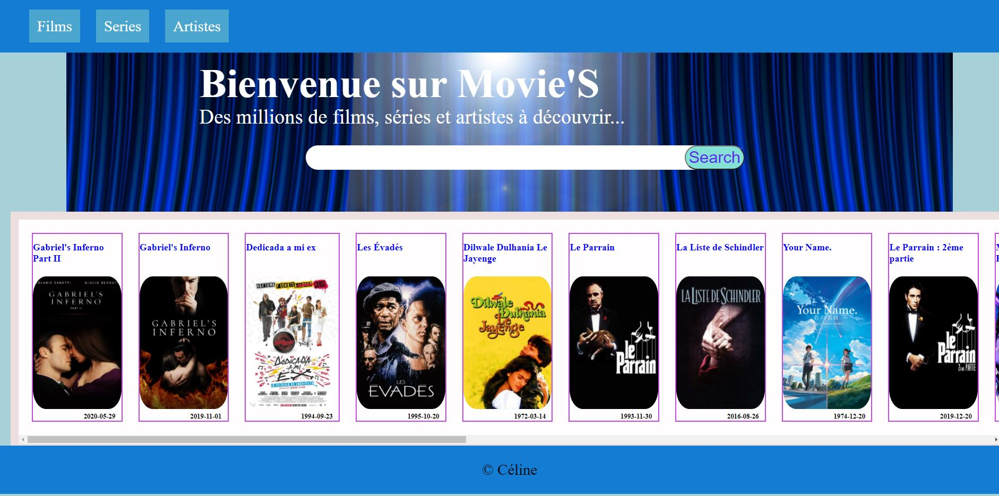

# Movie'S
Naviguez sur movie's et recherchez vos films préferés pour plus d'informations

[Lien du site 👉](https://celine-movies-tmbd.netlify.app/)

## insttructions Dev
Servez-vous de l'API du site [TMDB](https://www.themoviedb.org/documentation/api)

Récupérez la liste des films en utilisant une requête **fetch** et affichez les :muscle: